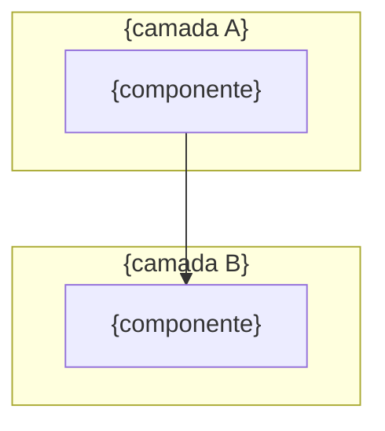

<!--
  TEMPLATE CANÔNICO — SOT de Arquitetura de Sistema/Serviço (destilado via R14)
  Destilado de 7 exemplares reais (allfluence + sinkra-hub). Ver section-matrix.md.
  Legenda de classificação por seção:
    [universal]            → presente em ≥80% dos exemplares — SEMPRE incluir
    [condicional: GATILHO] → incluir só quando o gatilho se aplica
    [por-tipo: TIPOS]      → incluir conforme o tipo de sistema documentado
    [rara]                 → opcional; só um exemplar tinha — incluir se agregar
  Tipos de sistema observados: servico-api | framework | orquestrador | modelo-dados | reverse-eng | blackbox-observed
  Disciplina: No-Invention — toda seção traça a ≥1 exemplar real OU vira *Informação faltante*.
  Substitua todos os {placeholders}. Veja variable-dictionary.md.
-->

# {nome-do-sistema} — {subtítulo de escopo} (Super-Doc / SOT)

<!-- [universal] — Frontmatter de metadados. Dois estilos observados:
     (A) blockquote ">" (5/7 exemplares) — recomendado para legibilidade
     (B) tabela "| | |" (wave-conductor) ou YAML frontmatter (squad-creator-pro)
     Use o blockquote a menos que o doc precise de campos machine-readable (então YAML). -->

> **Versão:** {semver, ex: 1.0.0}
> **Data:** {YYYY-MM-DD}
> **Status:** {CANONICAL SOT | SKELETON | DRAFT | CONGELADO}
> **Owner:** {responsável, ex: Pedro Valério}
> **Escopo:** {1-3 linhas — o que este SOT cobre e o que NÃO cobre; branch/commit auditado se aplicável}
> _Preencha: delimite a fronteira do doc. Cite branch + commit quando documentar um codebase específico._
>
> <!-- [condicional: doc consolida ou substitui outras fontes] -->
> **Consolida / Substitui:** {lista de fontes absorvidas — N docs, paths}
>
> <!-- [condicional: existem SOTs irmãos] -->
> **Documentos canônicos complementares (NÃO duplicados — este SOT referencia):** {lista de SOTs/ADRs + seção}
>
> <!-- [condicional: sistema lida com segredos] -->
> **Cofre de segredos (gitignored):** {path do cofre} — _este SOT mascara segredos e aponta para o cofre._
>
> <!-- [condicional: doc é reverse-engineering OU tem inferências] -->
> ⚠️ **Convenção de confiança:** **[CONFIRMADO]** (observado no código/config) · **[INFERIDO]** (deduzido, não medido) · **\*Informação faltante\*** (não capturável — ver §Gaps). _Modo blackbox-observed (decode de plataforma de terceiro sem código):_ **[OBSERVED]** (capturado em HAR/DOM da plataforma viva) · **[PROBED]** (hipótese testada via probe in-session). Nunca apresento inferência como fato.
>
> **Regra de ouro:** todo claim deste documento traça a um arquivo/fonte real, citado inline. Nada foi inventado.

---

## Índice
<!-- [universal] — numerado, com âncoras. Para super-docs longos, inclua sub-itens (4.1, 4.2…). -->

1. [Identidade & Tech Stack](#1-identidade--tech-stack)
2. [Topologia de Componentes (Top-View)](#2-topologia-de-componentes-top-view)
3. [{seção de domínio núcleo — modelo de dados / conceitos / block model / DAG}](#3-)
4. [{seção de domínio — API / eventos / fluxos / componentes}](#4-)
5. [Integrações Externas & Pipelines](#5-integrações-externas--pipelines)
6. [{frontend / funcionalidades / camada agêntica — se aplicável}](#6-)
7. [Auth & Segurança](#7-auth--segurança)
8. [Configuração, Env Vars & Deploy](#8-configuração-env-vars--deploy)
9. [{Setup Local & Runbook / Operação}](#9-)
10. [Glossário](#10-glossário)
11. [Riscos, Gaps & Pendências](#11-riscos-gaps--pendências)
12. [{Anti-patterns — se aplicável}](#12-anti-patterns)
13. [Referências](#13-referências)
14. [Change Log](#14-change-log)

---

## Como Ler Este Documento
<!-- [universal nos super-docs / [rara] nos reverse-eng] — tabela "se você quer entender X → vá para §Y" -->

Este é o **super-doc canônico** de {sistema}. Reúne {dimensões cobertas} em um único lugar.

| Se você quer entender... | Vá para |
|--------------------------|---------|
| O que é {sistema}, stack, números | §1 |
| Como todos os subsistemas se conectam (1 diagrama) | §2 |
| {pergunta de domínio núcleo} | §3 |
| {pergunta de API/fluxo} | §4 |
| Como as integrações externas funcionam E2E | §5 |
| {pergunta de frontend/agêntica} | §6 |
| Login, guard, RLS/autorização | §7 |
| Env vars, config, deploy | §8 |
| Como subir/operar na prática | §9 |
| O que está quebrado / pendente / arriscado | §11 |

> _Preencha: a tabela é o atalho de navegação por intenção. Liste só as perguntas reais que o leitor traz._

### Cenário Recorrente: "{nome do cenário}"
<!-- [condicional: super-doc didático] — UM cenário concreto que atravessa as seções, ancorando exemplos -->

> **{cenário-fio-condutor}** — {narrativa de 3-6 linhas com dados concretos que atravessa §X, §Y, §Z}.
> _Preencha: escolha um caso real e único; reuse-o em todas as seções para dar concretude. Ex.: "produzir um lote de criativos", "run de discovery", "mensagem no grupo do cliente"._

---

## 1. Identidade & Tech Stack
<!-- [universal] — presente em 7/7 -->

### 1.1 O Que É

**{nome-do-sistema}** — {URL/identificador} — é {definição de 2-4 linhas: o que faz, para quem, natureza}.

- **Natureza:** {SaaS público | ferramenta interna | serviço ONLINE | tooling LOCAL}
- **Owner técnico:** {pessoa/squad}
- **Boundary:** {LOCAL | ONLINE} — _(quando o sistema vive no ecossistema SINKRA; ver Boundary Axiom)_

> _Preencha: a primeira frase deve responder "o que é isto" sem jargão._

### 1.2 Tech Stack
<!-- [universal] — SEMPRE tabela | Camada | Tecnologia | Versão/Papel | -->

| Camada | Tecnologia | Versão / Papel |
|--------|-----------|----------------|
| **{Framework/Runtime}** | {tech} | {versão} |
| **{UI / API}** | {tech} | {versão} |
| **{DB / Auth}** | {tech} | {versão} |
| **{Filas / Cache}** | {tech} | {versão} |
| **{Storage}** | {tech} | {versão} |
| **{Integrações de orquestração}** | {tech} | {papel} |
| **{LLM}** | {provider/modelo} | {papel} |
| **{Deploy}** | {plataforma} | {ambiente/branch} |

> _Preencha: 1 linha por camada arquitetural. Marque versões exatas — é o que envelhece._

### 1.3 Números-Chave
<!-- [condicional: codebase real auditado] — métricas concretas que dimensionam o sistema -->

| Métrica | Valor |
|---------|-------|
| {ex: API routes / tabelas / containers / linhas} | {N} |
| {ex: migrations / eventos / canais} | {N} |
| {ex: componentes / hooks / pipelines} | {N} |

> _Preencha: números que ancoram o tamanho real. Omitir se for um doc de modelo/conceito puro._

---

## 2. Topologia de Componentes (Top-View)
<!-- [universal] — SEMPRE 1 diagrama Mermaid (graph TB/LR) + parágrafo "Leitura:" explicando o fluxo -->



**Leitura:** {1 parágrafo descrevendo o fluxo principal — quem fala com quem, onde está a persistência, por onde entram os dados}.

> _Preencha: 1 diagrama que cabe na cabeça. Use `subgraph` por fronteira (browser/server/externos). O parágrafo "Leitura" é obrigatório._

---

## 3. {Modelo de Dados / Conceitos Fundamentais / Block Model}
<!-- [por-tipo] — a seção de DOMÍNIO NÚCLEO. Escolha conforme o sistema:
     servico-api/modelo-dados → "Modelo de Dados (Schema)"  (tabelas + Status Machines + RLS + ERD)
     orquestrador            → "Conceitos Fundamentais / DAG"
     framework               → "Arquitetura em Camadas"
     reverse-eng (editor)    → "Block Model / Catálogo" -->

> {nota de contexto: quantas migrations/tabelas, engine de DB, padrão dominante}

### 3.1 Domínios e Tabelas / Conceitos
<!-- [condicional: sistema tem persistência] — agrupar tabelas por domínio, com colunas-chave -->

| Tabela / Conceito | Propósito | Colunas-chave / Notas |
|-------------------|-----------|------------------------|
| `{nome}` | {propósito} | {chaves} |

### 3.2 Enums / Vocabulário Controlado
<!-- [condicional: existem enums nativos] -->

| Enum | Valores |
|------|---------|
| `{enum}` | `{v1, v2, ...}` |

### 3.3 Status Machines (lifecycle)
<!-- [condicional: entidades têm lifecycle] — coluna → estados -->

| Entidade/Coluna | Estados |
|-----------------|---------|
| `{entidade}.status` | `{a → b → c → terminal}` |

### 3.4 Autorização / RLS
<!-- [condicional: sistema multi-tenant ou com auth] — policies, helper functions, modelo de ownership -->

{descrição do modelo de autorização — RLS habilitado, helper functions, papel-based, exceções service-role}

### 3.5 Diagrama de Relacionamentos (ERD)
<!-- [condicional: modelo de dados relacional] — ASCII tree ou Mermaid ER -->

```
{ASCII tree ou mermaid erDiagram das relações entre entidades}
```

> _Preencha: esta é a seção mais densa do doc para serviços-API. Para frameworks, substitua por "Arquitetura em Camadas"._

---

## 4. {Camada de API / Cadeia de Eventos / Fluxos / Catálogo}
<!-- [por-tipo] — a segunda seção de domínio. Escolha:
     servico-api  → "Camada de API (N Routes)"  (endpoints por domínio + padrões transversais)
     orquestrador → "Cadeia de Eventos / Pipeline"
     reverse-eng  → "Catálogo de comandos / Toolbars / Features" -->

### 4.1 {agrupamento de endpoints/eventos}

| Endpoint / Evento | Métodos / Trigger | Função | Toca |
|-------------------|-------------------|--------|------|
| `{rota/evento}` | {GET/POST/...} | {o que faz} | {tabelas/serviços} |

### 4.x Padrões Transversais
<!-- [condicional: há padrões repetidos cross-endpoint] — auth, erros, paginação, chaves de correlação -->

1. **Auth:** {padrão de autenticação por endpoint + exceções}
2. **Erros:** {padrão de tratamento}
3. **{chave de correlação / multiplexação por action / etc.}**

> _Preencha: liste APIs/eventos por domínio, não alfabético. Documente os padrões transversais uma vez._

---

## 5. Integrações Externas & Pipelines
<!-- [universal nos serviços / [condicional] frameworks] — tabela-mestre + catálogo + pipeline E2E -->

> {nota: como as integrações funcionam — sínc/assínc, via proxy, etc.}

### 5.1 Tabela-Mestre de Integrações

| Serviço | Propósito | Env vars | Como é chamado | Auth | Sínc/Assínc |
|---------|-----------|----------|----------------|------|-------------|
| **{serviço}** | {propósito} | `{ENV_VARS}` | {SDK/REST/webhook} | {tipo} | {S/A} |

### 5.2 {Catálogo de webhooks / chaves / rate-limits}
<!-- [condicional: orquestração assíncrona via webhook/fila] -->

### 5.3 Pipeline E2E (exemplo: {fluxo})
<!-- [condicional: existe pipeline assíncrono] — diagrama de sequência ASCII ou Mermaid -->

```
{trace passo-a-passo de um fluxo real, do trigger ao resultado persistido}
```

> _Preencha: 1 tabela-mestre + 1 pipeline E2E concreto. Marque sempre quais env vars cada integração consome._

---

## 6. {Frontend & Funcionalidades / Camada Agêntica}
<!-- [condicional: sistema tem UI ou camada agêntica complexa] — mapa de navegação + funcionalidades por módulo + jornadas E2E -->

### 6.1 Mapa de Navegação / Componentes
```
{árvore de rotas ou catálogo de componentes-chave}
```

### 6.2 Funcionalidades por Módulo

| Módulo | O que o usuário/agente FAZ |
|--------|----------------------------|
| **{módulo}** | {capacidades} |

### 6.3 Jornadas E2E
<!-- [rara] — jornadas nomeadas (J1, J2...) atravessando o sistema -->

- **J1 — {nome}:** {passo → passo → passo}.

> _Preencha: só para sistemas com superfície de usuário/agente relevante. Omitir em serviços headless/modelos de dados._

---

## 7. Auth & Segurança
<!-- [universal nos serviços / [condicional] frameworks/modelos] -->

- **Login / Entrada:** {mecanismo de auth}
- **Guard / Middleware:** {como rotas são protegidas}
- **Sessão:** {SSR/JWT/cookies}
- **Camada primária:** {RLS / policies / onde a autorização REALMENTE acontece}
- **Exceções:** {endpoints service-role / sem auth + justificativa}

> _Preencha: explicite qual é a camada de enforcement primária (geralmente RLS) e onde estão as exceções perigosas._

---

## 8. Configuração, Env Vars & Deploy
<!-- [universal] — presente em 7/7 (como "Config/Deploy" ou "Infraestrutura") -->

### 8.1 Catálogo de Env Vars

| Variável | Propósito | Exposição |
|----------|-----------|-----------|
| `{VAR}` | {propósito} | {Pública / Secreta} |

### 8.2 Config Local / Portas
<!-- [condicional: stack com portas/containers] — mapa de portas, config.toml, docker-compose -->

| Serviço | Porta | Notas |
|---------|-------|-------|
| {serviço} | {porta} | {nota} |

### 8.3 Deploy / CI
- {plataforma de deploy + branch/digest}
- {pipeline CI/CD + gates}
- {gotchas de build — ex: pre-build de packages, dist gitignored}

### 8.4 Estrutura de Pastas
<!-- [condicional: codebase] -->
```
{árvore de diretórios do código}
```

> _Preencha: o catálogo de env vars deve cobrir 100% das vars do código. Marque Pública vs Secreta._

---

## 9. {Setup Local & Runbook / Operação}
<!-- [condicional: sistema operável/deployável] — passo-a-passo reproduzível + gotchas + verificações -->

### 9.1 Subir do zero / Subir-parar-reiniciar
```bash
{comandos reproduzíveis, comentados}
```

### 9.2 Gotchas Recorrentes & Sinais

| Sintoma | Causa | Ação |
|---------|-------|------|
| {sintoma observável} | {causa-raiz} | {correção} |

### 9.3 Verificações Rápidas
```bash
{comandos de diagnóstico}
```

> _Preencha: o runbook deve permitir um terceiro subir/diagnosticar sem você. Documente os gotchas que você já sofreu._

---

## 10. Glossário
<!-- [universal] — presente em 7/7. Nos reverse-eng aparece cedo (§2); nos super-docs, perto do fim. -->

| Termo | Significado |
|-------|-------------|
| **{termo}** | {definição concisa} |

> _Preencha: todo acrônimo/nome-próprio do domínio. Um leitor novo deve decodificar o doc só com o glossário._

---

## 11. Riscos, Gaps & Pendências
<!-- [universal] — presente em 7/7 (como "Riscos & Pendências" ou "Limitações & Gaps"). Tabela numerada R1..Rn com severidade. -->

| # | Item | Severidade | Nota |
|---|------|-----------|------|
| R1 | {risco/gap/pendência} | {alta/média/baixa} | {detalhe + ação sugerida} |

> _Preencha: seja honesto sobre o que está quebrado, divergente ou não-implementado. Severidade calibra a atenção._

---

## 12. Anti-patterns
<!-- [por-tipo: reverse-eng, framework, orquestrador] — o que NUNCA fazer + por quê.
     Comum nos docs que viram referência de design para outro sistema. Omitir em serviço-API puro. -->

| Anti-pattern | Por quê | Detecção |
|--------------|---------|----------|
| {prática proibida} | {consequência} | {como flagrar} |

> _Preencha: capture as armadilhas que o doc existe para evitar. Omitir se o SOT não orienta construção de terceiros._

---

## 13. Referências
<!-- [universal] — código, skills/docs irmãos, rules/ADRs, research/evidência, cross-refs de memória -->

**Código:** {paths dos arquivos-fonte}
**Docs/Skills relacionados:** {SOTs irmãos, ADRs}
**Rules/Governança:** {rules aplicáveis}
**Research & evidência:** {paths de research, retrospectivas, PRs}
**Cross-refs de memória:** {[[memory-links]] se aplicável}

> _Preencha: a Regra de Ouro depende disto — cada claim do doc deve poder ser rastreado a um destes._

---

## 14. Change Log
<!-- [universal] — presente em 7/7. Tabela | Data | Versão | (Autor) | Mudança |. -->

| Data | Versão | Mudança |
|------|--------|---------|
| {YYYY-MM-DD} | {semver} | {descrição da criação/revisão — o que foi consolidado} |

---

*{nome-do-sistema} SOT v{versão} — {org} | Owner: {owner} | {data}*
*{linha de nota: divergências de branch, política de segredos — "Este doc nunca contém tokens/segredos em claro."}*
